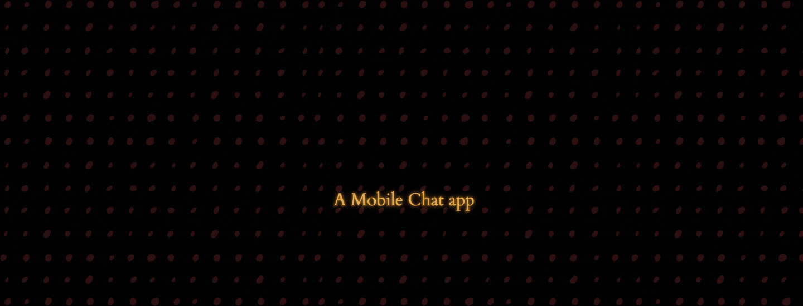

# Chat Bit

<p align="center">
   
</p>
<!-- PROJECT LOGO -->

[](https://GitHub.com/Naereen/StrapDown.js/graphs/commit-activity)

<!-- ABOUT THE PROJECT -->
## Built With

<p align="left">
   
   
   
</p>  


---

## 🔥 Screenshots

| Mockup-1 |
| - |
|  |

<!-- BUILT WITH -->  

## How to Install Locally

**1. Fork and clone this repository using**

   ```
   git clone https://github.com/sandip2224/<Repository_Name>.git
   cd <Repository_Name>/
   ```  

> Add necessary steps to get your project up and running locally  

**2.**  

**3.**  

**4.**

---

## License

Distributed under the _NAME_ License. See `LICENSE` for more information.  


## Contributing

If you'd like to contribute, please **fork** the repository and then raise a PR with necessary changes. Thank you.

---

## Found this project interesting?

If you found this project useful, then please consider leaving a :star: on Github
